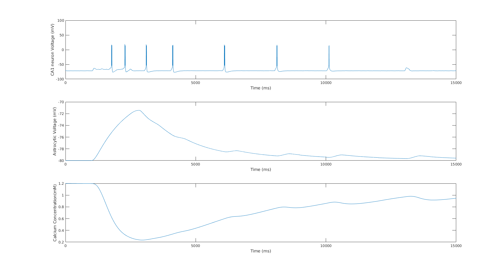
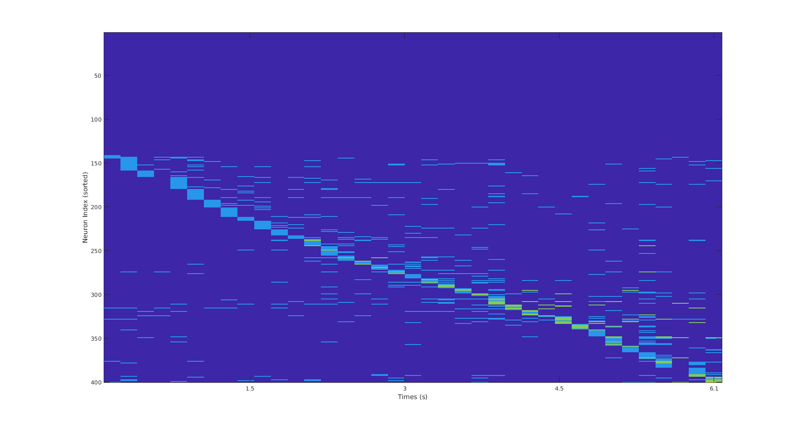

# The Role of Astrocytes in Place Cell Formation: A computational modeling study

This repository contains the implementation of the computational models presented in the paper "The Role of Astrocytes in Place Cell Formation: A computational modeling study" by Ioannis Polykretis and Konstantinos P. Michmizos.

## Software Requirements ##
MATLAB 2017 or higher.

## Example Usage ##

#### 1. Single-CA1-cell Model ####
Execute the file `SingleTransientPlaceCell.m` to run the model with the single-CA1-cell network. The file generates a plot demonstrating the gradual emergence and fading of the place field of the CA1 cell.

#### 2. CA1-population Model ####
Execute the file `PopulationTransientPlaceCells.m` to run the model with the CA1-cell-population network. The file generates a plot demonstrating the encoding of a circular track in the place fields of the CA1 cell population.

The remaining files are callable functions that are used to run the two simulation files.
 
### Acknowledgment ###

This research was supported by the National Center for Medical Rehabilitation Research (NIH/NICHD) K12HD093427 Grant and the Rutgers Office of Research and Innovation. Ioannis Polykretis was partially funded by the Onassis Foundation Scholarship.
